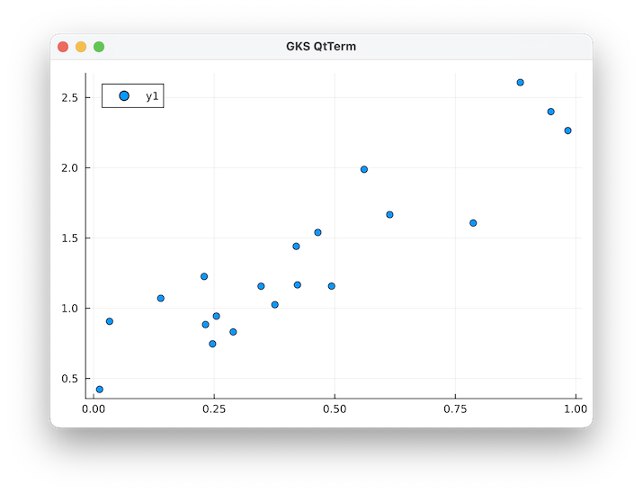
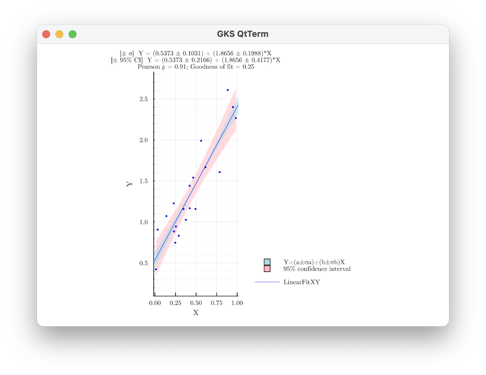
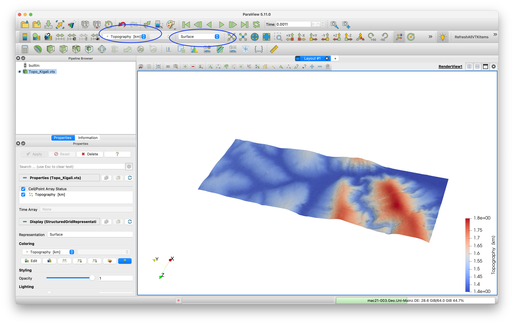
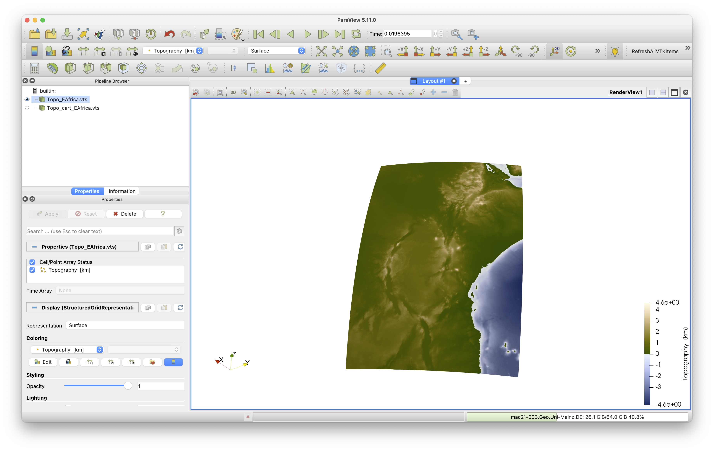

This tutorial has been taken from Boris Kaus (JGU) at https://github.com/boriskaus/Kigali-geodynamics-shortcourse/blob/main/JuliaIntro/IntroJulia.md

# Intro and Julia basics
*JGU Mainz, Introduction to julia*

## 1. Introduction
We will use the geodynamics code LaMEM to solve geoscientific problems. LaMEM was developed in Mainz and solves the governing equations (conservation of mass, momentum and energy) using a staggered finite difference method and a marker-in-cell approach using non-linear visco-elasto-plastic rheologies. It is one of the most advanced codes available at the moment and is fully parallel and 3D even when we will not use much of that capabilities during the semester.

What you will mostly be busy with is to create a model setup. This is described on the LaMEM [github page](https://github.com/UniMainzGeo/LaMEM/). For simple geometries you can use the build-in geometry tools but for more complicated cases it is useful to use Julia to create the model setup. The Julia scientific programming language is fast, completely open source and comes with a nice package manager.  It works on essentially all systems and has an extremely active user base. Moreover programming in julia is very similar to using MATLAB, so it will not be a big change for many of you.  As a result, we are slowly transitioning the codes in our research group to julia. 

We are assuming that you are not yet familiar with Julia. The purpose of these exercises is therefore to give you a crash course in how to install it on your system, create a few programs, make plots etc.

## 2. Installing Julia

#### 2.1 Retrieve julia
The best way to start is to download a recent version of julia (1.9.1) from [https://julialang.org](https://julialang.org) (use a binary installer). Install that on your 

#### 2.2 Install the julia plugin in VSCode
The recommended debugger for julia is [Microsoft Visual Studio Code](https://code.visualstudio.com), where you should install the julia [extension](https://marketplace.visualstudio.com/items?itemName=julialang.language-julia) which you find under "extensions" on the left side of the VSCode main window. See [this](https://code.visualstudio.com/docs/languages/julia) page for more info.

Once this is done (in the order indicated above), you can start the Julia REPL (which stands for `read-eval-print-loop`, similar to the command window in MATLAB) by typing in the Command Palette (which you find in VS Code under the menu View->Command Palette) (or push F1 on most machines):
```
>Julia: Start REPL
```

This will take a bit of time initially, as it needs to compile. Once that is done, you should see the following:


Make sure that the julia environment at the bottom is 1.9 (unlike the picture above which is a bit out of date).

## 3. First steps

Let's start with some simple calculations within the `REPL`
```julia
julia> 2+3
julia> 3*4
julia> 5^2
```

Powers are performed before division and multiplication, which are done before subtraction and addition.
```julia
julia> 2+3*4^2
```

The arrow keys allow 'command-line editing' which cuts down on the amount of typing required, and allows easy error correction. Press the "up" arrow, and add `/2`. What will this produce?
```julia
julia> 2+3*4^2/2
```

Parentheses may be used to group terms, or to make them more readable.
```julia
julia> (2+3*4^2)/2
```

The equality sign is used to assign values to variables.
```julia
julia> a = 3
julia> b = a^2
julia> a/b
```

If no other name is given, an answer is saved in a variable named `ans` 
```julia
julia> a/b
3.0

julia> ans
3.0

julia> c=2*ans
6.0

julia> ans
6.0
```

So far we worked with scalar values. We can always determine the type of a value with
```julia
julia> typeof(a)
Int64
```
which shows that `a` is an integer value.
If we define `a` as:
```julia
julia> a = 2.1
julia> typeof(a)
Float64
```
which shows that now `a` is a double precision number.

#### 3.1 Vectors
Until now we dealt with scalar values. Working with vectors in Julia is simple:
```julia
julia> x=0:.1:2
0.0:0.1:2.0
```
We can retrieve a particular value in the vector `x` by using square brackets:
```julia
julia> x[3]
0.2
```
Arrays in julia start at 1:
```julia
julia> x[1]
0.0
```

You can perform computations with `x`:
```julia
julia> y = x.^2 .+ 1
21-element Vector{Float64}:
 0.0
 0.010000000000000002
 0.04000000000000001
 0.09
 0.16000000000000003
 0.25
 0.36
 0.48999999999999994
 ⋮
 1.9599999999999997
 2.25
 2.5600000000000005
 2.8899999999999997
 3.24
 3.61
 4.0
```
Note the dot `.` here, which tells julia that every entry of `x` should be squared and `1` is added.
If you want a vector with values, they should be separated by commas:
```julia
julia> a=[1.2, 3, 5, 6]
4-element Vector{Float64}:
 1.2
 3.0
 5.0
 6.0
```

#### 3.2 Matrixes
A matrix in julia can be defined as
```julia
julia> a = [1 2 3; 4 5 6]
2×3 Matrix{Int64}:
 1  2  3
 4  5  6
```
Note that the elements of a matrix being entered are enclosed by brackets; a matrix is entered in "row-major order" (i.e. all of the first row, then all of the second row, etc); rows are separated by a semicolon (or a newline), and the elements of the row should be separated by a space.

The element in the i'th row and j'th column of `a` is referred to in the usual way:
```julia
julia> a[1,2]
2
```

The transpose of a matrix is the result of interchanging rows and columns.
Julia denotes the transpose by folowing the matrix with the single-quote [apostrophe]. 
```julia
julia> a'
3×2 adjoint(::Matrix{Int64}) with eltype Int64:
 1  4
 2  5
 3  6
```

New matrices may be formed out of old ones, in many ways. 
```julia
julia> c = [a; 7 8 9]
3×3 Matrix{Int64}:
 1  2  3
 4  5  6
 7  8  9
julia> [a; a; a]
6×3 Matrix{Int64}:
 1  2  3
 4  5  6
 1  2  3
 4  5  6
 1  2  3
 4  5  6
julia> [a a a]
2×9 Matrix{Int64}:
 1  2  3  1  2  3  1  2  3
 4  5  6  4  5  6  4  5  6
```

There are many built.-in matrix constructions. Here are a few: 
```julia
julia> rand(1,3)
1×3 Matrix{Float64}:
 0.0398622  0.229126  0.148148

julia> rand(2)
2-element Vector{Float64}:
 0.668085153596309
 0.4275013437388613

julia> zeros(3)
3-element Vector{Float64}:
 0.0
 0.0
 0.0

julia> ones(3,2)
3×2 Matrix{Float64}:
 1.0  1.0
 1.0  1.0
 1.0  1.0
```


Use a semicolon to suppress output within the REPL: 
```julia
julia> s = zeros(20,30);
```
This is useful, when working with large matrices.

An often used part of Julia is the 'colon operator,' which produces a list.
```julia
julia> -3:3
-3:3
```

The default increment is by 1, but that can be changed. 
```julia
julia> x=-3:.4:3
```
This can be read: `x` is the name of the list, which begins at -3, and whose entries increase by 0.4, until 3 is surpassed. You may think of `x` as a list, a vector, or a matrix, whichever you like. 

You may wish use this construction to extract "subvectors," as follows.
```julia
julia> x[4:8]
julia> x[9:-2:1]
julia> x=10:100;
julia> x[40:5:60]
```
The colon notation can also be combined with the earlier method of constructing matrices. 
```julia
julia> a= [1:6 ; 2:7 ; 4:9]
```

A very common use of the colon notation is to extract rows, or columns, as a sort of "wild-card" operator which produces a default list. The following command demonstrates this
```julia
julia> s=rand(10,5); s[6:7,2:4] 
2×3 Matrix{Float64}:
 0.163274  0.923631  0.877122
 0.210374  0.321996  0.281341
```
Matrices may also be constructed by programming. Here is an example, creating a 'program loop.', which shows how  
```julia
julia> A = [i/j for i=1:10,j=1:11]
```

## 4. Matrix arithmetic
If necessary, re-enter the matrices 
```julia
julia> a=[1 2 3; 4 5 6; 7 8 10]
julia> b=[1 1 1]'
```
Scalars multiply matrices as expected, and matrices may be added in the usual way; both are done 'element by element.' 
```julia
julia> 2*a, a/4
([2 4 6; 8 10 12; 14 16 20], [0.25 0.5 0.75; 1.0 1.25 1.5; 1.75 2.0 2.5])
```

Scalars added to matrices require you to add a dot, as

```julia
julia> a.+1
3×3 Matrix{Int64}:
 2  3   4
 5  6   7
 8  9  11
```
Matrix multiplication requires that the sizes match. If they don't, an error message is generated.
```julia
julia> a*b
3×1 Matrix{Int64}:
  6
 15
 25
julia> a*b'
ERROR: DimensionMismatch("matrix A has dimensions (3,3), matrix B has dimensions (1,3)")
Stacktrace:
 [1] _generic_matmatmul!(C::Matrix{Int64}, tA::Char, tB::Char, A::Matrix{Int64}, B::Matrix{Int64}, _add::LinearAlgebra.MulAddMul{true, true, Bool, Bool})
   @ LinearAlgebra /Users/julia/buildbot/worker/package_macos64/build/usr/share/julia/stdlib/v1.6/LinearAlgebra/src/matmul.jl:814
 [2] generic_matmatmul!(C::Matrix{Int64}, tA::Char, tB::Char, A::Matrix{Int64}, B::Matrix{Int64}, _add::LinearAlgebra.MulAddMul{true, true, Bool, Bool})
   @ LinearAlgebra /Users/julia/buildbot/worker/package_macos64/build/usr/share/julia/stdlib/v1.6/LinearAlgebra/src/matmul.jl:802
 [3] mul!
   @ /Users/julia/buildbot/worker/package_macos64/build/usr/share/julia/stdlib/v1.6/LinearAlgebra/src/matmul.jl:302 [inlined]
 [4] mul!
   @ /Users/julia/buildbot/worker/package_macos64/build/usr/share/julia/stdlib/v1.6/LinearAlgebra/src/matmul.jl:275 [inlined]
 [5] *(A::Matrix{Int64}, B::Matrix{Int64})
   @ LinearAlgebra /Users/julia/buildbot/worker/package_macos64/build/usr/share/julia/stdlib/v1.6/LinearAlgebra/src/matmul.jl:153
 [6] top-level scope
   @ REPL[107]:1
```

A matrix-matrix multiplication is done with:
```julia
julia> a*a
3×3 Matrix{Int64}:
  30   36   45
  66   81  102
 109  134  169
```
whereas adding a dot performs a pointwise multiplication: 
```julia
julia> a.*a
3×3 Matrix{Int64}:
  1   4    9
 16  25   36
 49  64  100
 ```

## 5. Adding packages

Now it would be nice to create a plot of the results. In order to do so, you first need to install a plotting package. Many excellent are available, with the most widely used ones being [Plots.jl](https://docs.juliaplots.org/latest/) and [Makie.jl](https://makie.juliaplots.org/stable/).

Before being able to use a package, we first need to install it. Julia has a build-in package manager that automatically takes care of dependencies (that is: other packages that this package may use, including the correct version). You can start the package manager by typing `]` in the REPL:

```julia
julia> ]
(@v1.6) pkg> 
 ```

If you want to go back to the main REPL, use the backspace key.

As an example, lets install the `Plots` package:

```julia
(@v1.6) pkg> add Plots
 ```
This is will download and precompile all dependencies and will look something like this: 

The plotting package is fairly large so this will take some time, but this only has to be done once.  

Once the installation is done, you can test whether the package works by running the build-in testing suite of that package (which is available for most julia packages):
```julia
(@v1.6) pkg> test Plots
 ```
This should look something like:

Note that this takes a looong time, depending on your machine. If you get impatient, you can stop this with `CTRL-C`.

Once you are done with the package manager, go back to the `REPL` with the backspace button.


#### 5.1 Add more packages
Since we are installing packages, lets do some more. In this class we will be using the following packages:
- [GeophysicalModelGenerator](https://github.com/JuliaGeodynamics/GeophysicalModelGenerator.jl/tree/main). This is useful to visualize geophysical data in 3D and create model setups.
- [GLMakie](https://docs.makie.org/stable/). This is a plotting package that is fully written in julia.
- [LaMEM](https://github.com/JuliaGeodynamics/LaMEM.jl). This is the 3D geodynamics code, we will be using later
- [LinearFitXYerrors](https://github.com/rafael-guerra-www/LinearFitXYerrors.jl). This is a small package that can be used to fit a straight line between data points. 


Please install them in the package manager. For `LaMEM` and `GeophysicalModelGenerator`, you can also run the testsuite, to make sure all is fine on your machine (the `GLMakie` tests take a really long time).

## 6. Create plots
Now that the plotting package is install, we are ready to create our first plot. First you load the `Plots` package
```julia
julia> using Plots
 ```
Next create a plot with
```julia
julia> plot(x,y)
 ```


If you are using VSCode, it should show the plot in a seperate tab as in the figure above.

We can add labels etc. with:

```julia
julia> x=0:.1:2
julia> y=x.^2 .+ 1
julia>  plot(x,y, xlabel="x", ylabel="y axis", title="my first plot",label=:none, color=:red)
 ```
which gives:


There are lots of options within the plotting package.  Have a look at the tutorial [here](https://docs.juliaplots.org/latest/).
If you are used to work with MATLAB/Octave, here a quick summary of how plotting options are called in the Plots.jl package of julia:

|MATLAB/Octave       |  Julia      |
|------------------  | ------------|
| plot(x,y,'r--')    | plot(x,y,linestyle=:dash, color=:red)  |
| scatter(x,y)       | scatter(x,y)
| mesh(x,y,z)        | wireframe(x,y,z)  |
| surf(x,y,z)        | plot(x,y,z,st=:surface)
| pcolor(x,y,z)      | heatmap(x,y,z)  |
| contour(x,y,z,50)  | contour(x,y,z,level=50)  |
| contourf(x,y,z)    | contour(x,y,z,level=50,fill=true)  |


## 7. Functions
A function in julia can be defined in an extremely simple manner:
```julia
julia> f(x) = x.^2 .+ 10
f (generic function with 1 method)
 ```
You can now use this function with scalars, vectors or arrays:
```julia
julia> f(10)
110
julia> x=1:3
julia> f(x)
3-element Vector{Int64}:
  11
  14
  19
julia> y=[1 2; 3 4]
julia> f(y)
2×2 Matrix{Int64}:
 11  14
 19  26
 ```

Functions ofcourse don't have to be one-liners, so you can also define it as:
```julia
julia> function f1(x)
         y = x.^2 .+ 11
         return y
       end
f1 (generic function with 1 method)
 ```
This creates a new array `y` and returns that.

So how fast is this function? Lets start with defining a large vector:
```julia
julia> x=1:1e6;
 ```

It turns out that julia has a handy build-macro, called `@time`, with which you can record the time that a function took.
```julia
julia> @time f1(x)
  0.035543 seconds (205.05 k allocations: 21.952 MiB, 25.37% gc time, 69.65% compilation time)
1000000-element Vector{Float64}:
 12.0
 15.0
 20.0
 27.0
 36.0
 47.0
 60.0
 75.0
 92.0
  ⋮
  9.9998600006e11
  9.99988000047e11
  9.99990000036e11
  9.99992000027e11
  9.9999400002e11
  9.99996000015e11
  9.99998000012e11
  1.000000000011e12
 ```
So this took 0.09 seconds on my machine. Yet, the first time any function in julia is executed, it is compiled and that's why 94% of the time was the compilation time. If we run the same function again, it is much faster and creates 2 allocations:
```julia
julia> @time f1(x)
  0.006275 seconds (2 allocations: 7.629 MiB)
 ```   

In general, it is a very good idea to put things in functions within julia, as it allows julia to precompile the routines.  
Also note that you need to restart the `REPL` or your Julia session every time you redefine a function or a structure.

If you want to do some more serious benchmarking, you need to install the package [BenchmarkTools](https://github.com/JuliaCI/BenchmarkTools.jl), which runs the function 1000 times and does the timings:
```julia
julia> using BenchmarkTools
julia> @btime f($x);
  1.110 ms (2 allocations: 7.63 MiB)
 ```

note that you have to put a `$` sign in front of ever variable that is passed into the function. In this case the function took about a millisecond.


## 8. Scripts
In general, you want to put your code in a julia script so you don't have to type it always in the REPL. Doing that is simple; you simple save it as a textfile that had has `*.jl` as an ending.
A simple example is the following `test1.jl` script:

 ```julia
  using Plots

  function rosenbrock(x,y; a=1,b=100)
      xt = x'     # transpose  
      f  = (a .- xt).^2 .+ b.*(y .- xt.^2).^2
      return f
  end

  x = range(-2.0,2.0,length=50)
  y = range(-1.0,1.5,length=50)
  f = rosenbrock(x,y)

  # Create a contourplot
  contour(x,y,f, levels=0:10:200, fill=true, 
          xlabel="X", ylabel="y", title="rosenbrock", 
          color=:roma, clim=(1,200))
 ```
Note that the rosenbrock function has optional parameters (`a,b`). Calling it with only `X,Y` will invoke the default parameters, but you can specify the optional ones with `f=rosenbrock(x,y, b=200,a=3)`.
You can run this script in the julia in the following way:
 ```julia
 include("test1.jl")
 ```
Be aware that you need to be in the same directory as the script (see below on how you can change directories using the build-in shell in julia, by typing `;` in the REPL).
The result looks like (have a look at how we customized the colormap, and added info for the axes).


## 9. Getting help

In general, you can get help for every function by typing `?` which brings you to the help terminal. Next type the name of the function.
For example, lets find out how to compute the average of an array 
```julia
julia>?mean
 ```

You can add help info to your own functions by adding comments before the function, using `"""`
```julia
""" 
    y = f2_withhelp(x)

Computes the square of `x` and adds 10 

Example
=======

julia> x=1:10
julia> y = f2_withhelp(x)
10-element Vector{Int64}:
  11
  14
  19
  26
  35
  46
  59
  74
  91
 110
"""
function f2_withhelp(x)
    y = x.^2 .+ 10
    return y
end
 ```

#### 9.1 Build-in terminal
Julia has a build in terminal, which you can reach by typing `;`. This comes in handy if you want to check in which directory you are, change directories, or look at the files there. 

```julia
julia>;
shell> pwd
/Users/kausb
 ```
Note that this invokes the default terminal on your operating system, so under windows the commands are a but different than under linux.
Once you are done with the terminal, you get back to the `REPL`, by using the backspace.

#### 9.2 Online help
The official julia [manual](https://docs.julialang.org/en/v1/) is a good place to start. Many of the julia packages are hosted on github and have help pages as well. An example, which we will use in this class, is [GeophysicalModelGenerator.jl](https://github.com/JuliaGeodynamics/GeophysicalModelGenerator.jl)


If you click on the blue buttons, you will be taken to the help pages. Note that it is quite easy to generate a new package in julia, add tests for that package, and create an online documentation. Doing that goes beyond the scope of this class, but if you are interested you can ask us or look at the julia manual.

## 10. Fitting a line through data-points

Imagine that we have some points and we want to fit a line through them
```julia
julia> x = rand(20)
julia> y = 2*x .+ rand(20)
4-element Vector{Float64}:
  3.0
  9.0
 19.0
 33.0
 ```
 Note that you need to add `.`.
 Lets plot this:
 ```julia
 julia> using Plots
 julia> scatter(x,y)
 ```


So obviously, there is some trend. 

Now, lets fit a line through it. For that we can use the package we installed earlier:
```julia
julia> using LinearFitXYerrors 
julia> st = linearfitxy(x,y, isplot=true);
>>> [± σ]  Y = (0.5373 ± 0.1031) + (1.8656 ± 0.1988)*X 
>>> [± 95% CI]  Y = (0.5373 ± 0.2166) + (1.8656 ± 0.4177)*X 
>>> Pearson ρ = 0.911;  Goodness of fit = 0.248 
```


So in this case the slope of the line is 1.86. Since we use random numbers, it might look slightly different for you.

#### Determining power law coefficients
Now lets consider the following equation:
$b=2.1a^3$
There is an easy way to retrieve the powerlaw coefficient (3 in this case), by taking $\log_{10}$ of the equation:
$\log_{10}(b) = 3\log_{10}(a) + \log_{10}(2.1) $

Let's try:
```julia
julia> a = range(0.1,4.0)
julia>julia> b = 2.1*a.^3
4-element Vector{Float64}:
  0.0021000000000000007
  2.795100000000001
 19.448100000000004
 62.56110000000001
```


Note that if you want to take the $\log_{10}$ of every entry in `a`, you need to add a `.`:
```julia
julia> log10.(a) 
4-element Vector{Float64}:
 -1.0
  0.04139268515822508
  0.3222192947339193
  0.4913616938342727
```
That implies that the function `log10` is applied to every element in `a`.

Now we can compute the linear fit:
```julia
julia> st = linearfitxy(log10.(a),log10.(b), isplot=true);

>>> [± σ]  Y = (0.3222 ± 0.0000) + (3.0000 ± 0.0000)*X 
>>> [± 95% CI]  Y = (0.3222 ± 0.0000) + (3.0000 ± 0.0000)*X 
>>> Pearson ρ = 1.000;  Goodness of fit = 0.000 
```
And indeed the powerlaw is 3.0 (as we have no random noise in this case)

Keep the trick with the logarithms in mind as we will use it tomorrow.

## 11. Setting properties on markers
A common operation you will do during this class is setting material properties on markers.
Let's do some warming-up exercises for that. 

We start with defining the `X,Z` coordinates of the markers:
```julia
julia> x=-5:.1:5
julia> z=-10:.2:0
julia> X = ones(size(z))*x'
julia> Z = z*ones(size(x))' 
julia> Phase = zeros(Int64,size(X)) 
```
`Phase` is now a 2D array that defined the "rocktype" (or Phase) of ever marker, which is defined by the 2D coordinate arrays `X,Z`. Hint: you can copy-paste the whole block above tou your julia `REPL`. It will automatically remove the `julia>` at the beginning of every line.

#### 11.1 Square

Now let’s assume that all points between x=[-1 .. 1] and z=[-5 .. -4] have a different rock type. We can use that by finding all points that are between these coordinates, using the `findall` command.
```julia
julia> ind = findall( (X.>-1) .&  (X.<1) .& (Z.>-5) .& (Z.<-4) );
julia> Phase[ind] .= 1
```
Note that you have to add brackets around every statement and that you have to use a dot (`.`) to indicate that it applies for every entry in the arrays.
Let's create a plot of the result:
```julia
julia> using Plots
julia> ind = findall(Phase .== 0 )
julia> scatter(X[ind],Z[ind],color=:blue, legend=false, markersize=3)
julia> ind = findall(Phase .== 1 )
julia> scatter!(X[ind],Z[ind],color=:red,markersize=3)
```
Note that we use the exclamation mark (`!`) to indicate that we want to keep the previous plot.

#### 11.2 Circle
Similarly, we can add a circle with radius 2 and center (-2,-6) with
```julia
julia> xc,zc =-2,-6
julia> ind = findall( (X.-xc).^2 .+ (Z.-zc).^2 .< 2^2 )
julia> Phase[ind] .= 2
julia> id0, id1, id2 = findall(Phase.==0), findall(Phase.==1), findall(Phase.==2)
julia> scatter(X[id0],Z[id0],color=:blue,markersize=3)
julia> scatter!(X[id1],Z[id1],color=:red,markersize=3)
julia> scatter!(X[id2],Z[id2],color=:green,markersize=3)
```
#### 11.3 Polygons
We can also create more complicated polygons, by first creating the `x` and `z` coordinates of the polygon, and subsequently using the inpolygon function, which is part of the [PolygonOps.jl](https://github.com/JuliaGeometry/PolygonOps.jl) package, which you'll have to install first:
```julia
julia> xp=[-2, 0, 3, 4, 0, -2]
julia> zp=[-6, -3, -7, -2, -1, -6]
julia> using PolygonOps
julia> polygon = [[x,z] for (x,z) in zip(xp,zp)]
julia> inside = [inpolygon([x,z], polygon) for (x,z) in zip(X,Z)]
julia> Phase[inside .== true] .= 3
julia> id3 = findall(Phase.==3)
julia> scatter!(X[id3],Z[id3],color=:yellow,markersize=3, legend=:none)
```
The result looks like this:


Note that we introduced a new julia concept here, namely inline iterators:
```julia
julia> polygon = [[x,z] for (x,z) in zip(xp,zp)]
6-element Vector{Vector{Int64}}:
 [-2, -6]
 [0, -3]
 [3, -7]
 [4, -2]
 [0, -1]
 [-2, -6]
``` 
This statement loops over all points in `xp,zp` and extracts `x,z` of that point, which it than puts in a vector `polygon` (which is what `PolygonOps` wants to have - see the help page of that package). 
Each entry of polygon thus contains the `x,z` coordinates of the respective point of the polygon:
```julia
julia> polygon[3]
2-element Vector{Int64}:
  3
 -7
```

#### 11.4 Topography
As a final exercise in this part, lets assume we also have a topography, and we want to set all markers above the topography to be "air".

```julia
julia> x_topo =[-5, -2, -1,     1,  2,  5]
julia> z_topo =[-1, -1, -0.1,-0.1, -1, -1]
 ```
In this case, we want to know at which elevation the topography is for a given X-coordinate. For that, we can use the [Interpolations.jl](https://github.com/JuliaMath/Interpolations.jl) package which provides many (multi-dimensional) interpolation routines.
```julia
julia> using Interpolations
julia> interp_linear = LinearInterpolation(x_topo, z_topo)
julia> Z_topo = interp_linear.(X)
julia> ind = findall(Z.>Z_topo)
julia> Phase[ind] .= 4
julia> id4 = findall(Phase.==4)
julia> scatter!(X[id4],Z[id4],color=:lightblue,markersize=3, legend=:none)
 ```


## 12. Using GeophysicalModelGenerator
The package [GeophysicalModelGenerator](https://github.com/JuliaGeodynamics/GeophysicalModelGenerator.jl) is quite handy to collect data of different parts of the world, and visualize that in 3D using [Paraview](https://github.com/JuliaGeodynamics/GeophysicalModelGenerator.jl) which is an open-source 3D visualisation package. It has a large amount of [tutorials](https://juliageodynamics.github.io/GeophysicalModelGenerator.jl/dev) to show you how this works for different cases.

Let's do some exercise with this, and plot the topography of Kigali. This requires you to install both the `GMT` and `GeophysicalModelGenerator` packages:

```julia
julia> using GeophysicalModelGenerator, GMT
```
The function `ImportTopo` can be used to import topography from any part of the world, by specifing the southwest and northeast corners. 
If you want to know how it works, ask help:
```julia
julia>?ImportTopo
search: ImportTopo importWKT

  Topo = ImportTopo(limits; file::String="@earth_relief_01m.grd")

  Uses GMT to download the topography of a certain region, specified with limits=[lonmin, lonmax, latmin, latmax]

  Note:
  ≡≡≡≡≡≡≡

    •  latitude values in the southern hemisphere should have a minus sign (e.g., -2.8)

    •  longitude values that are "west" should either come with a minus sign or are defined by values >180

  Dataset             Resolution                                                   Description
  ––––––––––––––––––– –––––––––– –––––––––––––––––––––––––––––––––––––––––––––––––––––––––––––
  "@earth_relief_01s"  1 arc sec      SRTM tiles (14297 tiles, land only, 60S-60N) [NASA/USGS]
  "@earth_relief_03s"  3 arc sec      SRTM tiles (14297 tiles, land only, 60S-60N) [NASA/USGS]
  ...
  ```

  The center of Kigali has latitude=-1.93 and longitude=30.08. We can automatically download the topography with:

```julia
julia> Topo = ImportTopo(lat=[-1.95,-1.92], lon=[30.0, 30.1],  file="@earth_relief_01s.grd")
GMT [WARNING]: Remote dataset given to a data processing module but no registration was specified - default to gridline registration (if available)
grdblend [ERROR]: Option -V given more than once
GeoData 
  size      : (361, 121, 1)
  lon       ϵ [ 30.0 : 30.1]
  lat       ϵ [ -1.95 : -1.916666666666667]
  depth     ϵ [ 1.357 : 1.419]
  fields    : (:Topography,)
  attributes: ["note"]
 ```
The structure `Topo` now contains the topography. We can write that into a file format that Paraview can read with:
```julia
julia> Write_Paraview(Topo, "Topo_Kigali")
Saved file: Topo_Kigali.vts
```

Next you can open this in paraview:



*Exercise a*
Now retrieve a topgraphic map of East Africa around lon = [25,45] and lat=[-15,15].    
*Important*: make sure that you use a lower resolution, otherwise the datafile becomes massively large!! Start with "@earth_relief_15m.grd".
. 
Note that to make this look like a topographic map, I used thhe "Oleron" colormap provided on [this webpage](https://www.fabiocrameri.ch/colourmaps/).

*Exercise b*
Many numerical models use cartesian coordinates; yet often the data is given in longitude/latitude. GMG provides a tool to project lon/lat to cartesian coordinates, around a specific projection point.
For this, we first define the projection point:
```julia
julia> p=ProjectionPoint(;Lat=0.0,Lon=35.0)
ProjectionPoint(0.0, 35.0, 722595.439675681, 0.0, 36, true)
```
Next, we can convert the data to cartesian and save it to disk with:
```julia
julia> Topo_cart = Convert2CartData(Topo,p)
CartData 
    size    : (241, 361, 1)
    x       ϵ [ -1115.7215697630252 : 1122.6425618608757]
    y       ϵ [ -1693.89601325424 : 1693.89601325424]
    z       ϵ [ -4.612 : 4.6205]
    fields  : (:Topography,)
  attributes: ["note"]
julia> Write_Paraview(Topo_cart, "Topo_cart_EAfrica")
Saved file: Topo_cart_EAfrica.vts
  ```
This map is easier to deal with. We also get an idea of the size of the map (in kilometers).

*Exercise c*
The GeophysicalModelGenerator.jl package comes with many tutorials. Have a look at the tutorial [Generating LaMEM model](https://juliageodynamics.github.io/GeophysicalModelGenerator.jl/dev/man/LaPalma_example/) which shows how to create a 3D volcano setup.
